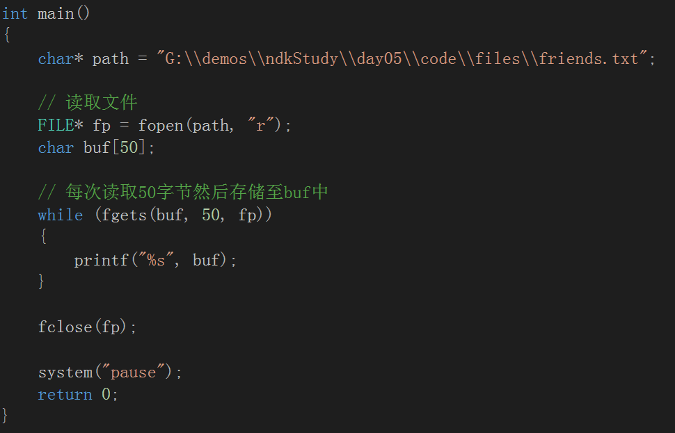
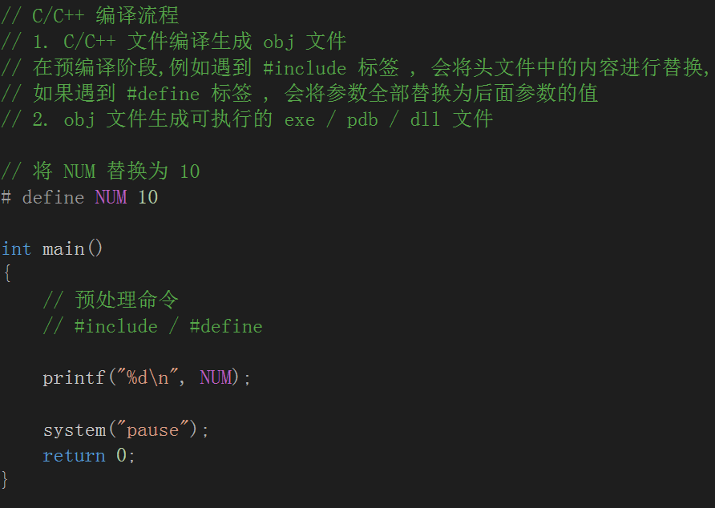

# C语言标准函数速查

[C语言标准函数速查](http://ganquan.info/standard-c/)

[极客学院C教程](http://wiki.jikexueyuan.com/project/c/)

# C语言操作文件

## 读写操作

### 网上资料

### 读取文本文件

### 写入文本文件

### 二进制文件读取写入

## 获取文件大小

## 案例:文件加解密

## 预处理

### C/C++ 编译运行流程

### 几种用法

#### 方法中使用 #include

#### 通过使用 #define 省略函数的声明

### #include 使用 <> 与 "" 的区别

- <> 一般适用于系统定义好的头文件

  - 查看系统定义的头文件

  	

  	

- 其他自定义的地方只能使用 ""

### 预处理 #ifdef

