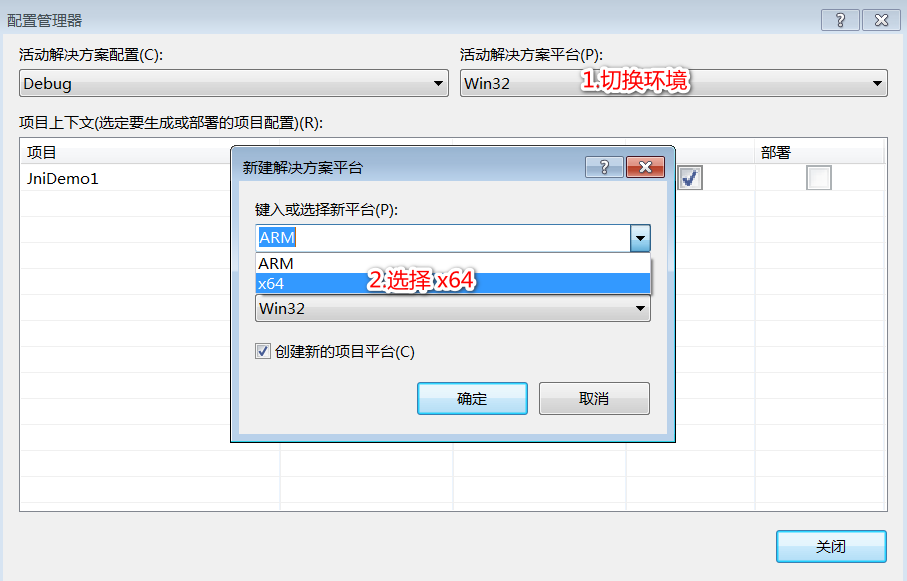
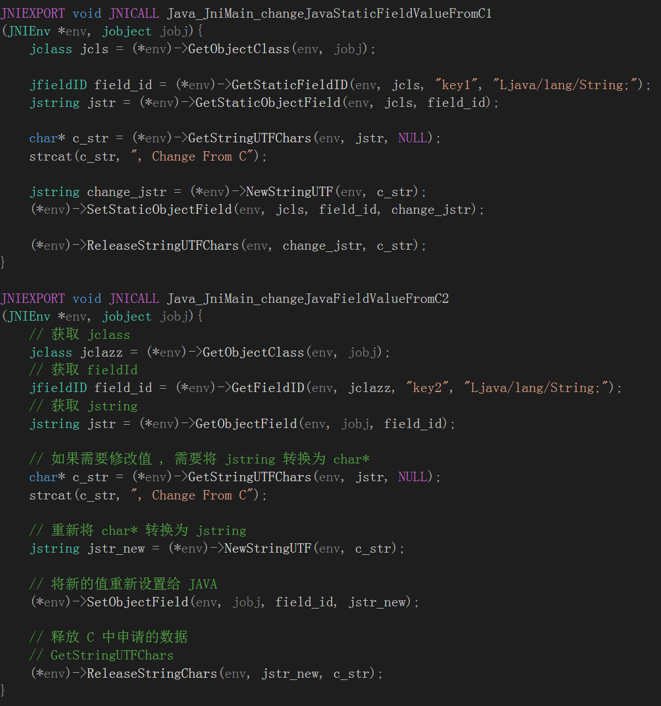

# JNI

## 定义

- JNI 是 JAVA 与 C/C++ 通信的接口 , 使用 JNI 可以使 JAVA 和 C/C++ 相互调用

### 与 NDK 的区别

- NDK 是一系列工具的集合
- 在 Android 中,常用来将 Application 与 so 等文件一起打包生成 apk

## 开发步骤

### 编写 native 方法

### 使用 javah 命令 , 生成 .h 文件

### 将 .h 文件拷贝到 C++ 工程中

### C++ 工程的头部添加现有项

### 由于头文件需要引入 jni.h 文件 , 需要从 JDK 中寻找 jni.h 文件

### .h 文件的引入方式进行修改

### 由于 jni.h 文件中需要引入 jni.md

### 实现 .h 头文件中的函数

### 生成一个 dll 动态库

- 当点击生成解决方案时,会报错

### 在 JAVA 中加载动态库

### JAVA 中触发 native 函数

## 静态库和动态库

### 静态库

- 一般以 .a 为主
- 在编译阶段会直接链接到目标代码中

### 动态库

- 一般以 .dll (windows) / .so (linux) 为主
- 在编译阶段不会直接链接到目标代码中 , 是在程序执行的时候动态加载的

## JNIEnv

## 非静态函数的调用

## jclass 与 jobject

- 每个 native 函数至少有两个参数 ( JNIEnv* , jclass/jobject)
- 如果第二个参数为 jclass ,  那么该方法为静态方法
- 如果第二个参数为 jobject ,  那么该方法为非静态方法

## JNI 数据类型

## 获取 JAVA 方法的签名

## 通过 C 语言修改 JAVA 的值

