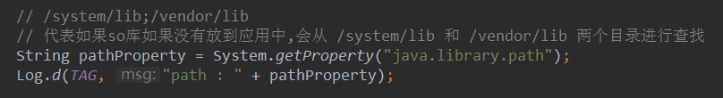
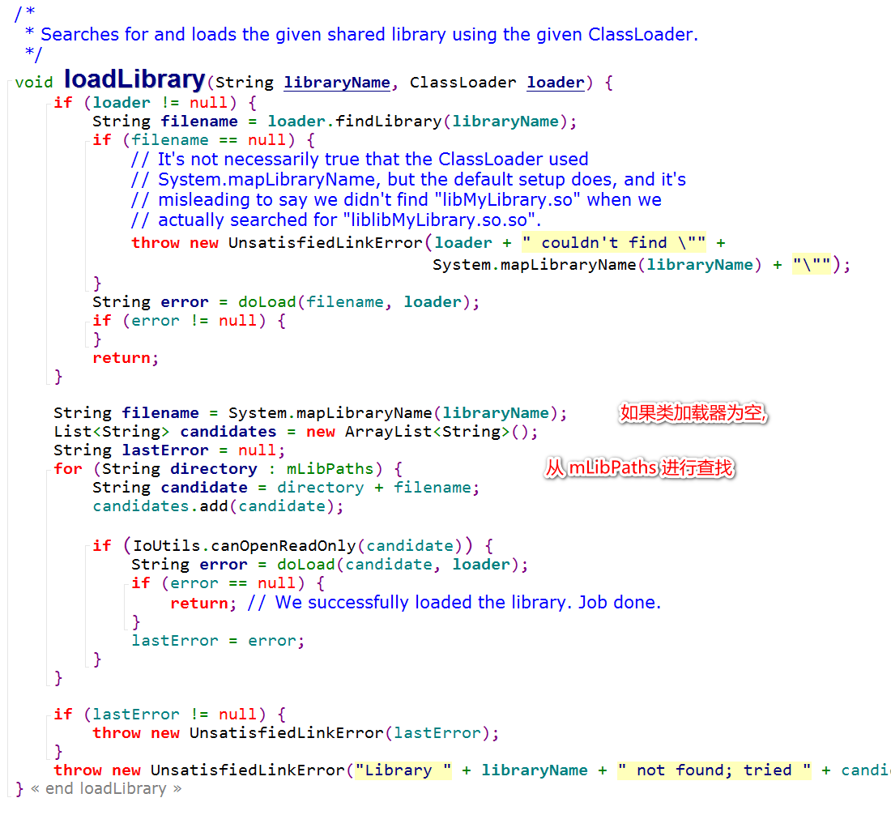

# C/C++ 生成二进制文件的流程

## 流程

### 编译

- .c 文件编译生成中间文件 .obj文件(windows平台) .o文件(Linux平台) 
- 主要做语法检查

### 链接

- 将中间文件(.o / .obj)链接生成为 .dll / .exe / .so  等文件

## 案例

- 例如现在有4个文件 a.c , a.h , b.c , b.h ,如果 a.c 需要调用 b.h 中的 test 方法,在编译阶段会去 b.h中寻找是否有 b.h 方法,在链接阶段会去 b.o 中查询 test方法的实现体,如果找不到,会报 Linked Error 异常,如果找的到,会生成 so 文件

# 编译规则

## Eclipse

- GUN 编译器
- 识别的文件 Android.mk

## Android Studio

- LLVM 编译器
- 识别的文件 CMakeList.txt

# Android Studio 引入 Log

# Android 查找 so 库原理

## JVM 区分 native 方法与 JAVA 方法

### ACC_NATIVE

## System.loadLibrary 原理

### 查询 so 库的全路径

#### 类加载器不为空情况下

#### 类加载器为空情况下

### so 库加载流程

# 动态注册

