# 增量更新

## 介绍

- [BisPath官网](http://www.daemonology.net/bsdiff/)
- 差分过程是耗时的,一般运行在服务器中
- 压缩采用 bzip2 算法 [bizp2官网](www.bzip.org/downloads.html)
- 目的:节约服务器的流量成本

## APK 安装过程

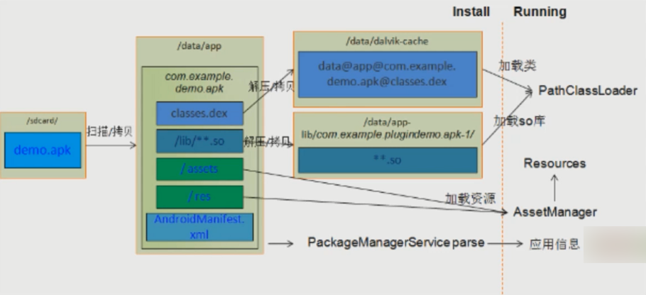

## 哈夫曼算法

### 原理

1. 比较二进制文件,如果是相同内容,则只保存索引
2. 如果是不相同的内容,会保存索引及通过bzip2压缩后的内容

## 差分框架介绍

### 文件介绍

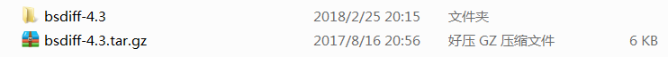

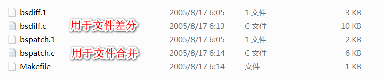

### 差分框架源码

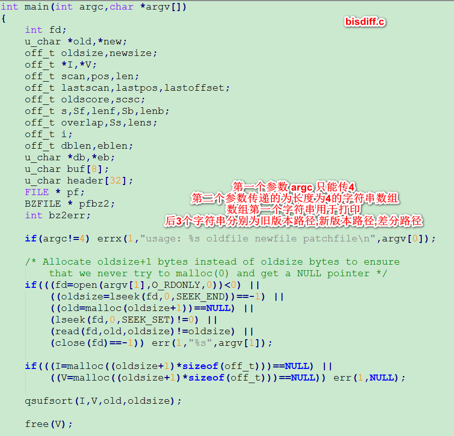

## windows 环境差分步骤

### 下载 Windows 环境的差分源码

 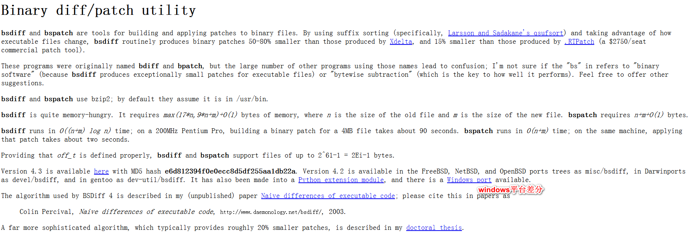

- 源码见 code目录下的 bsdiff4.3-win32-src.zip

 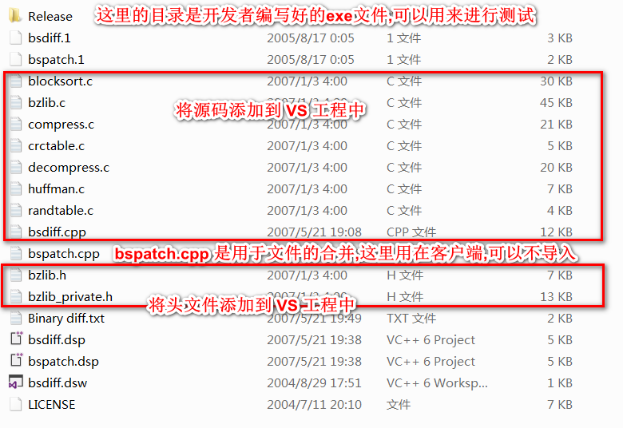

### 头文件引入问题

- 如果头文件与C/C++源文件不在同一个目录,会有报错的提示,这里有两种方案进行解决

	- 方案1
	
		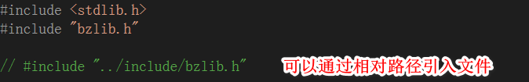	
	
	- 方案2(推荐)

		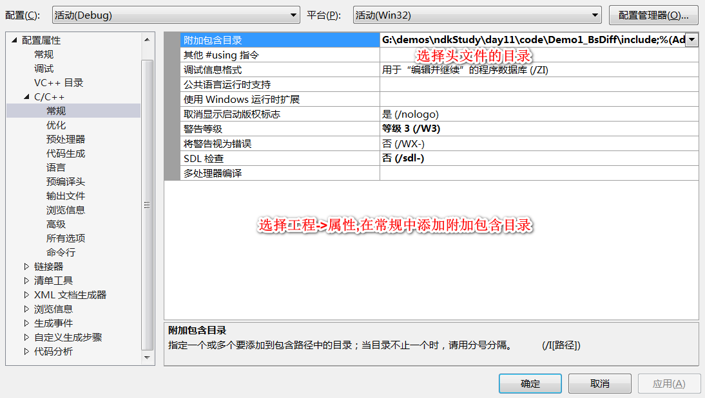

### 编译exe文件测试

编译的过程中会遇到两个编译错误的地方,需要修改相应的配置

- 第一个错误

	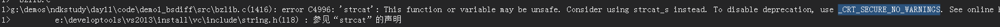

	- 解决方式

	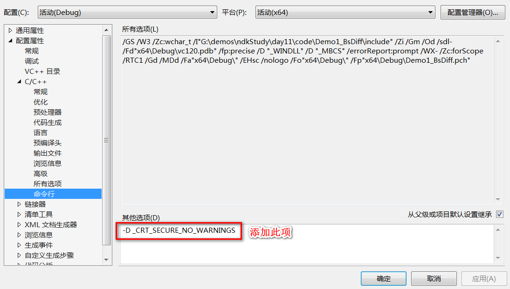

- 第二个错误

	

	- 解决方式

	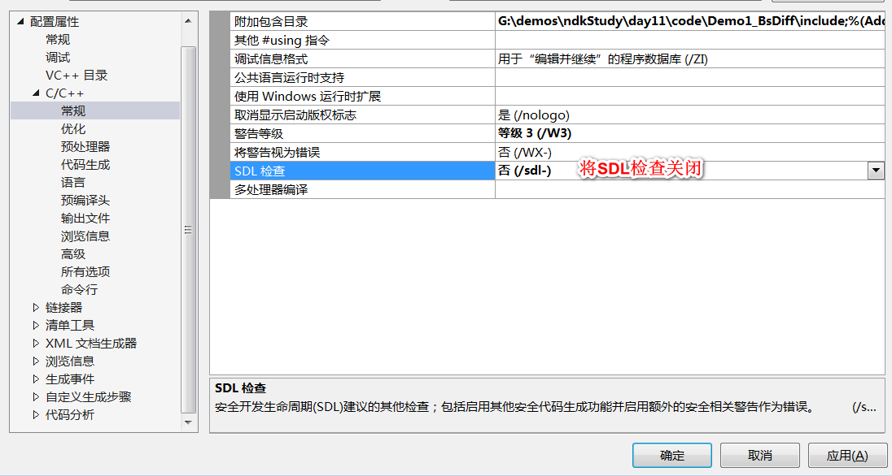

- 然后重新编译,exe文件生成成功,生成的exe文件可以手动用来对文件进行差分测试

	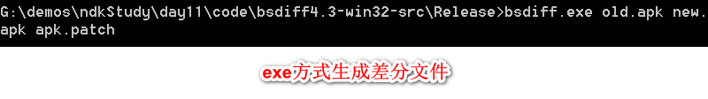

### 服务器工程中使用差分动态库

- JAVA方法的编写

	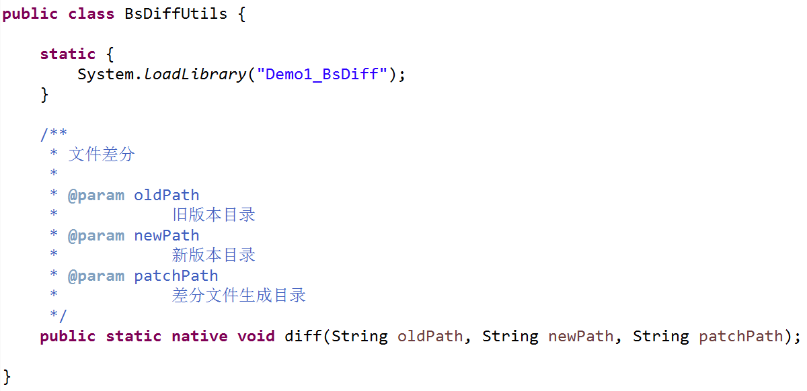

- 生成.h文件
- 将.h文件添加到VS工程中
- 修改bsdiff.cpp源码

	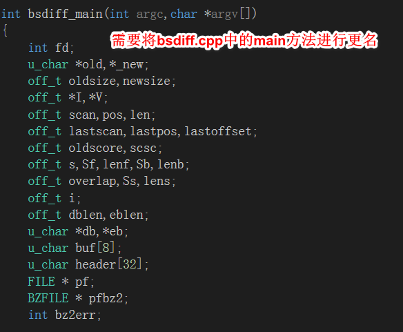

	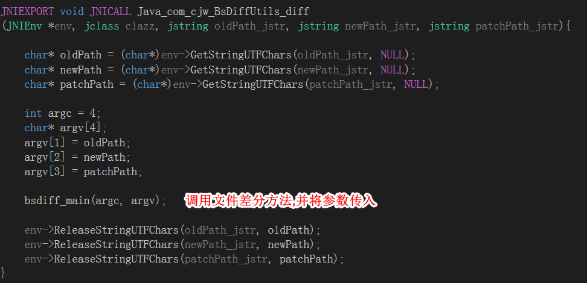

- 生成 dll 动态库
- eclipse 工程中引入动态库并进行调用