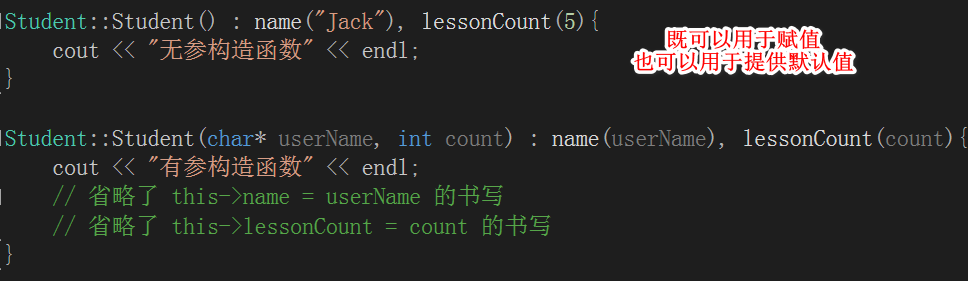

# 程序的内存分配

### 堆（heap）空间

- 动态分配的内存（malloc 等api 分配在堆空间, c++中的new）
- 堆用于存放进程运行时动态分配的内存段，可动态扩张或缩减。堆中内容是匿名的，不能按名字直接访问，只能通过指针间接访问

### 栈(stack)空间
- 局部变量、函数参数、返回地址等（系统自动分配的临时内存）Linux有专门的寄存器管理栈内存（效率高）

### .bss段
- 未初始化或初值为0的全局变量和静态局部变量

### .data段
- 已初始化且初值非0的全局变量和静态局部变量

### .text段
- 可执行代码、只读变量,全局静态变量

# C++ 引用

## 概念

- 引用是原变量的一个别名
- n 相当于m 的别名（绰号），对n 的任何操作就是对m 的操作。例如有个人叫是JackMa，绰号是“马爸爸”。说“马爸爸”怎么怎么的，其实就是在说JackMa。所以n 既不是m 的拷贝，也不是指向m 的指针，其实n就是m 它自己

## 优点

- 单纯给变量取别名没有任何意义，作为函数参数传递，能保证参数传递过程中不产生副本
- 引用可以直接操作变量，指针要通过取值(*p)，间接操作变量，指针的可读性差

## JAVA 的引用和句柄

- 举例陈冠希 和 “陈老师”的联系，在艳照门发生前，说起“陈老师” 人帅，器大，活好，大家都不知道指的是陈冠希（构造函数的作用）
- 内存分配在堆空间， 引用和句柄分配在栈空间

## 案例

## 指针与引用的区别

- 指针是一个实体，而引用仅是个别名
- 引用使用时无需解引用（*），指针需要解引用
- 引用只能在定义时被初始化一次，之后不可变；指针可变
- 引用“从一而终”
- 引用没有 const，指针有 const，const 的指针不可变
- 引用不能为空，指针可以为空
- “sizeof 引用”得到的是所指向的变量（对象）的大小，而“sizeof 指针”得到的是指针本身（所指向的变量或对象的地址）的大小

## 常用的引用方式

- 指针的引用---代替二级指针

# C与JAVA定义对象的区别

## 示例1

	Person p;	

### 区别

- C++ 这条语句执行完毕,已经在堆内存中进行了初始化并赋值给该对象
- JAVA 中,只是栈内存中开辟了一块空间,并没有进行初始化和赋值,只能通过new关键字才可以进行初始化和赋值

## 示例2

	// C++
	Person *p = new Person();

	// Java
	Person p = new Person();

### 区别

- C++ 如果通过 new 关键字创建的对象,被赋值的变量一定是一个指针变量
- JAVA 通过 new 关键字创建的对象,被赋值的变量已经是一个指针,它指向堆内存中对象的首地址

# 使用 adb 命令查看 JAVA 与 C 占用的内存

## 格式

	adb shell dumpsys meminfo 应用包名

# C++ 构造函数

- C++ 为每个类默认提供了一个无参数的构造函数
- 如果开发者为这个类提供了其他的构造函数,那么这个默认的构造函数也就不存在了,需要额外声明无参数构造函数
- 如果一个类没有默认的无参数构造函数,那么它的子类在构造函数中必须调用其他的构造函数

# C++创建对象提供默认值

# new关键字

# 拷贝构造函数

## 定义方式

- 类名(const 类名 &变量名)

## 会调用拷贝构造函数的几种情况

## 拷贝构造函数使用注意点

### 浅拷贝

### 深拷贝

# C++ 中的继承

## 定义

## 使用

# 隐式调用与显示调用

# 多继承

- C++ 中支持多继承

## 继承的二义性

### 解决方式

- 虚方法

- 虚继承

# 纯虚函数,抽象类,接口

